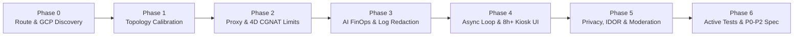

# Agy Skills Catalog

A curated repository of modular, production-grade skills for **Agy** (`agy`) and compatible AI coding agents. Each skill packages structured workflows, domain reference guides, verification scripts, and output templates that you can install individually into a workspace or globally across your environment.

---

## Table of Contents

- [Overview](#overview)
- [Prerequisites](#prerequisites)
- [Quickstart Installation](#quickstart-installation)
- [Skill Catalog](#skill-catalog)
- [Featured Skill: Google Cloud, Generative AI & Live-Event Security Audit (`app-security-audit`)](#featured-skill-google-cloud-generative-ai--live-event-security-audit-app-security-audit)
- [Skill Reference by Category](#skill-reference-by-category)
  - [1. Security, Cloud Architecture & Infrastructure](#1-security-cloud-architecture--infrastructure)
  - [2. Google ADK & Vertex AI Agent Engine](#2-google-adk--vertex-ai-agent-engine)
  - [3. Product Management, Research & Specifications](#3-product-management-research--specifications)
  - [4. UI/UX Design, Technical Drawing & Visual Explanations](#4-uiux-design-technical-drawing--visual-explanations)
  - [5. Presentations & Executive Communication](#5-presentations--executive-communication)
  - [6. Software Engineering, Testing & Developer Operations](#6-software-engineering-testing--developer-operations)
- [Database Migration Toolkit](#database-migration-toolkit)
- [Contributing](#contributing)
- [License](#license)

---

## Overview

Agy Skills extend your coding agent with repeatable engineering workflows across six core disciplines:

1. **Security, Cloud Architecture & Infrastructure**: Discover exposed routes, audit BFF proxies and CGNAT rate limits, prevent Vertex AI / Gemini FinOps exhaustion, redact induced API-key error logs, and draw interactive Google Cloud reference architectures.
2. **Google ADK & Vertex AI Agent Engine**: Build, deploy, manage sessions, and monitor multi-agent systems using Google's Agent Development Kit (ADK).
3. **Product Management, Research & Specifications**: Produce engineering-ready PRDs (`feature-spec`) and 6-lens local knowledge graphs (`research-skill-graph-agy`).
4. **UI/UX Design, Technical Drawing & Visual Explanations**: Audit interfaces against WCAG standards (`design-critique`), draw dimensioned orthographic SVGs (`technical-drawing`), and generate interactive HTML explainers (`visual-explainer`).
5. **Presentations & Executive Communication**: Compile Presentation Zen pitch decks (`zen-pitch`, `zen-presenter`), SCQA assertion-evidence decks (`clarity-presenter`), and editable PowerPoint files (`html-to-pptx`).
6. **Software Engineering, Testing & Developer Operations**: Troubleshoot production systems, write TDD execution plans, automate Playwright web testing, and upgrade Spring Boot applications.

---

## Prerequisites

- **Agy CLI** or a compatible AI agent environment that loads `SKILL.md` definitions from `.agents/skills/` or `~/.gemini/config/skills/`.
- **`curl`**, **`bash`**, and **`tar`** for one-command installation.
- **Optional runtime tools** (skill-dependent): `ripgrep` (`rg`), `python3`, `pytest`, `node` / `npx` (for Playwright or Marp slide compilation).

---

## Quickstart Installation

### Method 1: Install a single skill via `curl` (recommended)

Download only the requested skill directory without cloning the full repository.

**Workspace scope** (installs to `.agents/skills/<skill-name>/` in your current working directory):

```bash
curl -fsSL https://raw.githubusercontent.com/duboc/agy-skills/main/scripts/install.sh | bash -s -- <skill-name>
```

**User scope** (installs to `~/.gemini/config/skills/<skill-name>/` for global availability across all projects):

```bash
curl -fsSL https://raw.githubusercontent.com/duboc/agy-skills/main/scripts/install.sh | bash -s -- <skill-name> --scope user
```

### Method 2: Manual installation

Clone this repository and copy the target skill directory into your workspace or user configuration path:

```bash
git clone https://github.com/duboc/agy-skills.git
cd agy-skills

# Workspace scope
mkdir -p .agents/skills
cp -r skills/app-security-audit .agents/skills/app-security-audit

# User scope (global)
mkdir -p ~/.gemini/config/skills
cp -r skills/app-security-audit ~/.gemini/config/skills/app-security-audit
```

---

## Skill Catalog

| Skill Name | Category | Primary Use Cases | Key Deliverables | One-Command Install |
| :--- | :--- | :--- | :--- | :--- |
| **[`app-security-audit`](skills/app-security-audit/)** | Security & Cloud FinOps | End-to-end attack-surface discovery, BFF credential-swap & 4D CGNAT rate-limit auditing, Gemini FinOps & induced API-key error-log leak testing, `async def` & 8h+ kiosk resilience, LGPD/GDPR privacy | Route & GCP Surface Map, P0/P1/P2 Hardening Spec, `pytest` Fault-Injection Suite | `curl -fsSL https://raw.githubusercontent.com/duboc/agy-skills/main/scripts/install.sh \| bash -s -- app-security-audit` |
| **[`cloud-architecture-diagram`](skills/cloud-architecture-diagram/)** | Architecture & Cloud | Draw deployed systems using official Google Cloud icons, tinted environment boundaries, orthogonal routing, and stepped request flows | Self-contained interactive HTML diagram & stepped slideshow | `curl -fsSL https://raw.githubusercontent.com/duboc/agy-skills/main/scripts/install.sh \| bash -s -- cloud-architecture-diagram` |
| **[`ai-studio-architect`](skills/ai-studio-architect/)** | Architecture & Cloud | Convert Google AI Studio prototypes into production services on Cloud Run with Secret Manager and IAM hardening | Production deployment scripts, Dockerfile, Cloud Run config | `curl -fsSL https://raw.githubusercontent.com/duboc/agy-skills/main/scripts/install.sh \| bash -s -- ai-studio-architect` |
| **[`system-design`](skills/system-design/)** | Architecture & Cloud | Design distributed services, data models, and APIs with explicit trade-off analysis | System design document, capacity estimates, trade-off matrix | `curl -fsSL https://raw.githubusercontent.com/duboc/agy-skills/main/scripts/install.sh \| bash -s -- system-design` |
| **[`adk-developer`](skills/adk-developer/)** | Google ADK & Agents | Build single-agent and multi-agent systems with Google's Agent Development Kit (Python, Java, Go, TypeScript) | ADK agent code, tool definitions, callbacks, `adk eval` suites | `curl -fsSL https://raw.githubusercontent.com/duboc/agy-skills/main/scripts/install.sh \| bash -s -- adk-developer` |
| **[`agent-engine-deploy`](skills/agent-engine-deploy/)** | Google ADK & Agents | Deploy, update, and query ADK agents on Vertex AI Agent Engine | Deployment pipelines, runtime configurations, query clients | `curl -fsSL https://raw.githubusercontent.com/duboc/agy-skills/main/scripts/install.sh \| bash -s -- agent-engine-deploy` |
| **[`agent-engine-sessions-memory`](skills/agent-engine-sessions-memory/)** | Google ADK & Agents | Manage multi-turn sessions and persistent memory banks on Vertex AI Agent Engine | Session lifecycle managers, memory bank integration code | `curl -fsSL https://raw.githubusercontent.com/duboc/agy-skills/main/scripts/install.sh \| bash -s -- agent-engine-sessions-memory` |
| **[`agent-engine-ops`](skills/agent-engine-ops/)** | Google ADK & Agents | Monitor, trace, secure, and evaluate deployed agents on Vertex AI Agent Engine | Cloud Trace telemetry, IAM guardrails, evaluation pipelines | `curl -fsSL https://raw.githubusercontent.com/duboc/agy-skills/main/scripts/install.sh \| bash -s -- agent-engine-ops` |
| **[`feature-spec`](skills/feature-spec/)** | Product & Research | Write engineering-ready PRDs, INVEST user stories (`AC-US01-1`), API contracts, WCAG rules, PII telemetry schemas, and MoSCoW scope plans | 12-section PRD, Given/When/Then criteria, API & telemetry tables | `curl -fsSL https://raw.githubusercontent.com/duboc/agy-skills/main/scripts/install.sh \| bash -s -- feature-spec` |
| **[`research-skill-graph-agy`](skills/research-skill-graph-agy/)** | Product & Research | Investigate complex technical or strategic questions through 6 opposing analytical lenses on the local filesystem | `.research/` Markdown knowledge graph, contradiction matrices | `curl -fsSL https://raw.githubusercontent.com/duboc/agy-skills/main/scripts/install.sh \| bash -s -- research-skill-graph-agy` |
| **[`google-ads-funnel`](skills/google-ads-funnel/)** | Product & Research | Audit Google Ads accounts, analyze spend, test creatives, and diagnose conversions using Funnel-as-Code | Ads API audit reports, conversion diagnostics, funnel scripts | `curl -fsSL https://raw.githubusercontent.com/duboc/agy-skills/main/scripts/install.sh \| bash -s -- google-ads-funnel` |
| **[`design-critique`](skills/design-critique/)** | Design & Visualization | Evaluate UI mockups, screenshots, and frontend code (React/Tailwind/HTML) for hierarchy, usability, and WCAG 2.1 AA compliance | Prioritized P0–P3 UX audit report, concrete CSS/React fixes | `curl -fsSL https://raw.githubusercontent.com/duboc/agy-skills/main/scripts/install.sh \| bash -s -- design-critique` |
| **[`technical-drawing`](skills/technical-drawing/)** | Design & Visualization | Create scale-accurate orthographic SVG drawings (side/end/top views) with dimension lines (cotas), leader callouts, and FOV cones | Self-contained dimensioned SVG/HTML technical drawings | `curl -fsSL https://raw.githubusercontent.com/duboc/agy-skills/main/scripts/install.sh \| bash -s -- technical-drawing` |
| **[`design-system-management`](skills/design-system-management/)** | Design & Visualization | Architect design tokens, accessible component APIs, and governance documentation | Token taxonomy JSON/CSS, component specs, deprecation plans | `curl -fsSL https://raw.githubusercontent.com/duboc/agy-skills/main/scripts/install.sh \| bash -s -- design-system-management` |
| **[`ux-copywriter`](skills/ux-copywriter/)** | Design & Visualization | Write concise, accessible microcopy for CTAs, onboarding flows, empty states, and actionable error messages | UI copy decks, state microcopy tables, localization guidelines | `curl -fsSL https://raw.githubusercontent.com/duboc/agy-skills/main/scripts/install.sh \| bash -s -- ux-copywriter` |
| **[`visual-explainer`](skills/visual-explainer/)** | Design & Visualization | Build self-contained HTML pages that visually explain systems, code diffs, execution plans, and structured data | Interactive single-file HTML visual explainers | `curl -fsSL https://raw.githubusercontent.com/duboc/agy-skills/main/scripts/install.sh \| bash -s -- visual-explainer` |
| **[`zen-pitch`](skills/zen-pitch/)** | Presentations | Research a problem domain, build a narrative requirements spine, and compile a Presentation Zen slide deck | Research brief, narrative spine, Marp HTML/PDF/PPTX pitch deck | `curl -fsSL https://raw.githubusercontent.com/duboc/agy-skills/main/scripts/install.sh \| bash -s -- zen-pitch` |
| **[`zen-presenter`](skills/zen-presenter/)** | Presentations | Generate Marp presentation decks using Presentation Zen principles and Google identity styling | Self-contained HTML slide deck and optional PowerPoint export | `curl -fsSL https://raw.githubusercontent.com/duboc/agy-skills/main/scripts/install.sh \| bash -s -- zen-presenter` |
| **[`clarity-presenter`](skills/clarity-presenter/)** | Presentations | Generate Marp decks combining SCQA narrative structure with assertion-evidence slide design | Dual-perspective assertion-evidence HTML/PPTX slide deck | `curl -fsSL https://raw.githubusercontent.com/duboc/agy-skills/main/scripts/install.sh \| bash -s -- clarity-presenter` |
| **[`html-to-pptx`](skills/html-to-pptx/)** | Presentations | Convert Marp HTML presentations into editable PowerPoint (`.pptx`) files with native text boxes and tables | Native editable `.pptx` presentation file | `curl -fsSL https://raw.githubusercontent.com/duboc/agy-skills/main/scripts/install.sh \| bash -s -- html-to-pptx` |
| **[`software-troubleshooter`](skills/software-troubleshooter/)** | Engineering & Ops | Perform root-cause analysis and code inspection for bugs, regressions, and production incidents | Diagnostic report, root-cause proof, verified patch | `curl -fsSL https://raw.githubusercontent.com/duboc/agy-skills/main/scripts/install.sh \| bash -s -- software-troubleshooter` |
| **[`writing-plans`](skills/writing-plans/)** | Engineering & Ops | Produce granular, test-driven implementation plans with exact file paths and atomic verification steps | Step-by-step TDD implementation plan | `curl -fsSL https://raw.githubusercontent.com/duboc/agy-skills/main/scripts/install.sh \| bash -s -- writing-plans` |
| **[`using-git-worktrees`](skills/using-git-worktrees/)** | Engineering & Ops | Create isolated Git worktrees with `.gitignore` verification, dependency setup, and baseline test runs | Isolated Git worktree environment with verified test baseline | `curl -fsSL https://raw.githubusercontent.com/duboc/agy-skills/main/scripts/install.sh \| bash -s -- using-git-worktrees` |
| **[`webapp-testing`](skills/webapp-testing/)** | Engineering & Ops | Test local web applications with Playwright, managing server lifecycles, console logs, and DOM snapshots | Automated Playwright test scripts, screenshots, failure traces | `curl -fsSL https://raw.githubusercontent.com/duboc/agy-skills/main/scripts/install.sh \| bash -s -- webapp-testing` |
| **[`spring-boot-upgrader`](skills/spring-boot-upgrader/)** | Engineering & Ops | Migrate Spring Boot applications to version 4.0 with phased upgrade plans and Jackson 3 migration rules | Dependency migration plan, updated build files, compatibility fixes | `curl -fsSL https://raw.githubusercontent.com/duboc/agy-skills/main/scripts/install.sh \| bash -s -- spring-boot-upgrader` |
| **[`documentation`](skills/documentation/)** | Engineering & Ops | Write and maintain technical documentation, READMEs, API references, ADRs, and operational runbooks | Developer documentation, API reference guides, runbooks | `curl -fsSL https://raw.githubusercontent.com/duboc/agy-skills/main/scripts/install.sh \| bash -s -- documentation` |
| **[`developer-growth-analysis`](skills/developer-growth-analysis/)** | Engineering & Ops | Analyze session history to identify engineering patterns, recurring friction points, and learning paths | Developer growth report with targeted technical resources | `curl -fsSL https://raw.githubusercontent.com/duboc/agy-skills/main/scripts/install.sh \| bash -s -- developer-growth-analysis` |

---

## Featured Skill: Google Cloud, Generative AI & Live-Event Security Audit (`app-security-audit`)

[**`skills/app-security-audit/`**](skills/app-security-audit/) equips Agy to perform end-to-end attack-surface discovery, BFF proxy and CGNAT rate-limit auditing, Google Cloud and Generative AI FinOps hardening, induced API-key error-log leak testing, async event-loop unfreezing, and LGPD/GDPR privacy assessments.

### 7-Phase Discovery & Audit Workflow



### Core Security & Resilience Domains

1. **Phase 0 Automated Route & Google Cloud Attack-Surface Discovery**:
   - Uses targeted `ripgrep` (`rg`) playbooks to inventory FastAPI, Flask, Next.js, and Express HTTP/WebSocket routes, diffing them against BFF proxy tables and SPA routers to uncover unlinked debug routes (`/raw_feed`, `/calib_frame`, `/metrics`, `/unretire-all`).
   - Audits Cloud Run `--allow-unauthenticated` (`*.run.app`) origins, GKE `ingress.yaml` manifests exposing internal worker pods (`/voice-worker-1..5`, `/vision-inference-api`), Firestore full-collection `.stream()` scans, and Vertex AI / Gemini SDK sinks.
2. **4-Dimensional CGNAT & Venue Wi-Fi Rate Limiting**:
   - Calibrates rate limits to real network topologies where 50–500 attendees share a single public IPv4 via venue Wi-Fi NAT or mobile 4G/5G CGNAT.
   - Replaces flat per-IP limits (`5 req / 10 min`, which lock out legitimate users after the 5th person) with a 4-dimensional model: **L1 `GET`-minted signed device session cookie** (`HttpOnly` + `X-Device-Session` fallback, strictly verified on `POST`), **L2 canonical email cooldown**, **L3 split IP Burst (`6 req / 10s`) vs. Sustained (`30 req / 5 min`) buckets**, and **L4 physical QR presence tokens (`?v=<token>`)**.
3. **BFF Credential-Swap Hardening (`posixpath.normpath` & `X-App-Role`)**:
   - Prevents path-traversal (`..`) and prefix-based (`startswith`) privilege escalations when a BFF proxy swaps an operator cookie for a master backend token (`Authorization: Bearer MASTER_TOKEN`).
   - Enforces `posixpath.normpath(path)` normalization, explicit `(HTTP Method, Exact Route Regex)` allowlists, and `X-App-Role: operator` role scoping across backend routes (`force=False`) and UI components (`mode="operator"`).
4. **Generative AI FinOps, IAM `signBlob` Caching & Induced `GEMINI_API_KEY` Error-Log Redaction**:
   - Protects multi-call Gemini/Imagen pipelines with `X-Resource-Owner-Token`, terminal state locks, and indexed `FieldFilter` uniqueness checks.
   - Eliminates IAM `signBlob` (`generate_signed_url`) and GCE Metadata Server quota exhaustion via thread-safe in-memory TTL caching (50-minute cache for 60-minute URLs) and removal of UI hover prefetches (`onPointerEnter`).
   - **Prevents & tests `GEMINI_API_KEY` (`?key=AIza...` / `x-goog-api-key`) leakage in induced error logs**: Wraps `logging.setLogRecordFactory` (`install_secret_redaction()`) and attaches `SecretRedactingFilter` to handlers so Python's `Logger.callHandlers()` cannot bypass root filters when child loggers (`logging.getLogger(__name__)`) log `httpx.HTTPStatusError` exceptions, backed by a `pytest` + `caplog` fault-injection test recipe.
5. **FastAPI `async def` Event-Loop Unfreezing & 8h+ Kiosk/Broadcast Resilience**:
   - Converts `async def` endpoints calling synchronous Firestore, GCS, `signBlob`, or OpenCV I/O into threadpool `def` handlers and isolates background generation in a bounded `ThreadPoolExecutor`.
   - Eliminates 3.5 GB+ browser OOM crashes on 8-hour broadcast TVs by tracking both `activeBlobUrl` and `loadingBlobUrl` at 30 fps, and cuts audio-only WebSocket bandwidth by ~98% using `?mode=audio`.
6. **LGPD/GDPR Privacy, UUID Oracles & End-to-End Moderation**:
   - Strips existing entity UUIDs from `409 Conflict` errors, prevents orphaned participant PII on duplicate team errors, removes raw emails from session snapshots, and enforces `moderation_status == "approved"` across queues, leaderboards, and Gemini Live Audio prompts (`"Team #XXXX"` masking).

### Example Prompts & Expected Deliverables

| Prompt | Expected Output |
| :--- | :--- |
| `"Run a full 7-phase security audit and attack-surface discovery on this repository."` | Complete **Attack-Surface Map** (routes, proxies, Cloud Run/GKE origins, GenAI sinks), **Verification Table**, **P0/P1/P2 Remediation Spec** with exact Before/After code diffs, and **Active Test Matrix**. |
| `"Audit our registration and operator BFF proxy for CGNAT rate-limit lockouts and credential-swap escalation."` | 4D CGNAT rate-limiter implementation (`GET`-minted signed cookie + Burst/Sustained IP buckets) and `posixpath.normpath` + `(Method, Exact Regex)` BFF allowlist. |
| `"Add a fault-injection test verifying that induced Gemini HTTPStatusError exceptions never leak AIza API keys in logs."` | `install_secret_redaction()` (`setLogRecordFactory` + `SecretRedactingFilter`), `sanitize_exception()`, and a passing `pytest` `caplog` test covering child loggers. |

---

## Skill Reference by Category

### 1. Security, Cloud Architecture & Infrastructure

- **[`app-security-audit`](skills/app-security-audit/)**: Perform 7-phase application, Google Cloud (Cloud Run, GKE, Firestore, GCS, IAM), Generative AI (Vertex AI, Gemini, Imagen, Live API), BFF proxy, CGNAT rate-limit, async event-loop, 8-hour kiosk/TV, and LGPD/GDPR security audits.
- **[`cloud-architecture-diagram`](skills/cloud-architecture-diagram/)**: Render deployed Google Cloud systems as interactive, self-contained HTML architecture diagrams featuring official GCP icons, environment boundaries, collision-audited orthogonal connectors, and stepped slideshow walkthroughs.
- **[`ai-studio-architect`](skills/ai-studio-architect/)**: Migrate Google AI Studio Build-mode prototypes to production on Google Cloud Run with automated containerization, Secret Manager bindings, and IAM least-privilege configurations.
- **[`system-design`](skills/system-design/)**: Architect backend services, APIs, caching tiers, and data storage topologies with explicit capacity estimates and trade-off matrices.

### 2. Google ADK & Vertex AI Agent Engine

- **[`adk-developer`](skills/adk-developer/)**: Build single-agent and multi-agent architectures using Google's Agent Development Kit (ADK) across Python, Java, Kotlin, Go, and TypeScript (`LlmAgent`, `SequentialAgent`, `ParallelAgent`, `LoopAgent`, `LiveAgent`, MCP tools, and A2A protocol).
- **[`agent-engine-deploy`](skills/agent-engine-deploy/)**: Package, deploy, version, and query ADK agents on Vertex AI Agent Engine.
- **[`agent-engine-sessions-memory`](skills/agent-engine-sessions-memory/)**: Configure multi-turn session state persistence and long-term memory banks on Vertex AI Agent Engine.
- **[`agent-engine-ops`](skills/agent-engine-ops/)**: Set up OpenTelemetry tracing, safety guardrails (`before_model` callbacks, `LlmAsAJudge`), IAM policies, and continuous evaluation pipelines for production agents.

### 3. Product Management, Research & Specifications

- **[`feature-spec`](skills/feature-spec/)**: Author 12-section Product Requirements Documents (PRDs) with INVEST user stories, traceable Given/When/Then acceptance criteria (`AC-US01-1`), API contract tables, WCAG 2.1 AA requirements, PII telemetry schemas, LLM fallback budgets, and MoSCoW scope plans.
- **[`research-skill-graph-agy`](skills/research-skill-graph-agy/)**: Investigate complex technical, economic, and architectural questions through 6 structured lenses (`technical`, `economic`, `historical`, `geopolitical`, `contrarian`, `first-principles`) inside a local `.research/` Markdown graph.
- **[`google-ads-funnel`](skills/google-ads-funnel/)**: Run Funnel-as-Code audits for Google Ads accounts, analyzing campaign spend, creative variants, and conversion tracking diagnostics via the Google Ads API.

### 4. UI/UX Design, Technical Drawing & Visual Explanations

- **[`design-critique`](skills/design-critique/)**: Audit wireframes, screenshots, and frontend code (React, Tailwind, HTML/CSS) across a 7-pillar framework covering visual hierarchy, usability heuristics, CTA clarity, design token alignment, and WCAG 2.1 AA/AAA accessibility.
- **[`technical-drawing`](skills/technical-drawing/)**: Generate scale-accurate orthographic technical drawings in SVG (side, end, and top views) with architectural dimension lines (cotas), leader-line callouts, and camera/sensor field-of-view (FOV) cones.
- **[`design-system-management`](skills/design-system-management/)**: Define multi-tier design token taxonomies (primitive, semantic, component), accessible component prop APIs, and versioning governance.
- **[`ux-copywriter`](skills/ux-copywriter/)**: Craft clear, accessible interface microcopy for buttons, onboarding steps, empty states, confirmation dialogs, and recovery-oriented error messages.
- **[`visual-explainer`](skills/visual-explainer/)**: Generate self-contained interactive HTML explainers for system architectures, complex pull requests, implementation plans, and benchmark comparisons.

### 5. Presentations & Executive Communication

- **[`zen-pitch`](skills/zen-pitch/)**: Research a problem domain, synthesize a numbered requirements spine, and build a persuasive Presentation Zen slide deck in Marp HTML/PDF/PPTX formats.
- **[`zen-presenter`](skills/zen-presenter/)**: Create high-contrast, minimal Marp slide decks with Google identity styling, custom SVG visuals, and self-contained HTML output.
- **[`clarity-presenter`](skills/clarity-presenter/)**: Build technical and executive presentations using Situation-Complication-Question-Answer (SCQA) narrative flows and assertion-evidence slide layouts.
- **[`html-to-pptx`](skills/html-to-pptx/)**: Convert Marp HTML slide decks into native, editable PowerPoint (`.pptx`) files preserving text boxes, lists, tables, and embedded graphics.

### 6. Software Engineering, Testing & Developer Operations

- **[`software-troubleshooter`](skills/software-troubleshooter/)**: Diagnose production bugs, race conditions, and test failures using structured hypothesis testing and code inspection.
- **[`writing-plans`](skills/writing-plans/)**: Break down feature specifications into atomic, test-driven implementation plans with exact file paths, test cases, and verification commands.
- **[`using-git-worktrees`](skills/using-git-worktrees/)**: Provision isolated Git worktrees with automated directory selection, `.gitignore` safety checks, dependency installation, and baseline test verification.
- **[`webapp-testing`](skills/webapp-testing/)**: Automate end-to-end verification of local web applications using Playwright, including dev-server lifecycle management, screenshot capture, and browser console inspection.
- **[`spring-boot-upgrader`](skills/spring-boot-upgrader/)**: Upgrade Spring Boot applications to version 4.0 with automated dependency analysis, Jakarta EE adjustments, and Jackson 3 migration steps.
- **[`documentation`](skills/documentation/)**: Author and maintain READMEs, API reference guides, architecture decision records (ADRs), and operational runbooks following Google Developer Documentation style guidelines.
- **[`developer-growth-analysis`](skills/developer-growth-analysis/)**: Inspect coding agent session logs to surface workflow bottlenecks, recurring debugging patterns, and targeted engineering study materials.

---

## Database Migration Toolkit

Sybase-to-Cloud Spanner migration skills live in a dedicated repository: **[`duboc/sybase-migration-toolkit`](https://github.com/duboc/sybase-migration-toolkit)**.

---

## Contributing

To add a new skill or update an existing workflow, see [CONTRIBUTING.md](CONTRIBUTING.md). Ensure all `SKILL.md` and `README.md` files follow the [Google Developer Documentation Style Guide](https://developers.google.com/style) and contain zero project-specific hostnames, credentials, or absolute `file://` home-directory paths.

---

## License

This project is licensed under the Apache License 2.0. See the [LICENSE](LICENSE) file for details.
