# Google Cloud, Generative AI & Live-Event Security Audit (`app-security-audit`)

Discover exposed routes, audit Backend-for-Frontend (BFF) proxies, enforce CGNAT-safe rate limits, prevent Google Cloud and Generative AI FinOps exhaustion, eliminate induced API-key error-log leaks, and verify 8-hour browser and async event-loop resilience.

---

## Table of Contents

- [Overview](#overview)
- [Architecture & 7-Phase Workflow](#architecture--7-phase-workflow)
- [Specialized Audit Modes](#specialized-audit-modes)
- [Core Security & Resilience Domains](#core-security--resilience-domains)
- [Quickstart Prompts](#quickstart-prompts)
- [Reference Guides Inventory](#reference-guides-inventory)
- [Active Testing & Fault-Injection Recipes](#active-testing--fault-injection-recipes)
- [Installation](#installation)

---

## Overview

The `app-security-audit` skill provides a structured, 7-phase security and production-resilience audit workflow for applications built on Google Cloud (Cloud Run, GKE, Firestore, Cloud Storage, IAM), Generative AI pipelines (Vertex AI, Gemini Flash/Pro, Imagen, Gemini Live API, vLLM), BFF reverse proxies, operator consoles, and unattended live-event kiosks or broadcast displays.

### Core Principle

**Discover the full route and cloud surface first, calibrate controls to physical and network topology, verify every claim against exact source lines, and never deploy a security control that causes a self-inflicted denial of service (`self-DoS`) for legitimate users or operators.**

---

## Architecture & 7-Phase Workflow

The audit progresses sequentially from automated codebase and cloud surface discovery to active fault-injection verification.

```mermaid
flowchart LR
    subgraph Surface["Discovery & Topology"]
        P0["Phase 0: Route & GCP Discovery<br/>(FastAPI/Next.js, Cloud Run, GKE Ingress)"] --> P1["Phase 1: Topology Calibration<br/>(Managed Tablets vs. Public CGNAT Wi-Fi)"]
    end
    subgraph Edge["BFF Proxy & Edge Controls"]
        P1 --> P2["Phase 2: BFF Proxy & 4D Rate Limits<br/>(normpath, X-App-Role, GET Session Cookie)"]
    end
    subgraph CloudAI["GCP, GenAI & Runtime Resilience"]
        P2 --> P3["Phase 3: AI FinOps & Log Redaction<br/>(signBlob Cache, setLogRecordFactory)"]
        P3 --> P4["Phase 4: Async Loop & 8h+ Kiosk UI<br/>(Threadpool def, 30fps Dual-Blob, ?mode=audio)"]
    end
    subgraph Governance["Privacy & Verification"]
        P4 --> P5["Phase 5: LGPD/GDPR & Moderation<br/>(409 UUID Oracle, Snapshot PII, Live TTS)"]
        P5 --> P6["Phase 6: Active Fault Injection<br/>(pytest caplog, curl, P0-P2 Spec)"]
    end
```



| Phase | Focus Area | Key Verification Actions |
| :--- | :--- | :--- |
| **Phase 0** | **Route & GCP Surface Discovery** | Scan FastAPI/Flask/Next.js/Express routers, BFF proxy tables, Cloud Run `--allow-unauthenticated` manifests, GKE `Ingress` definitions, and GenAI SDK calls. |
| **Phase 1** | **Topology Calibration** | Calibrate controls to physical device counts (managed operator tablets, kiosks, broadcast TVs) and shared venue Wi-Fi / 4G-5G CGNAT networks. |
| **Phase 2** | **Edge Proxy & Network Security** | Audit `X-Forwarded-For` stripping, `*.run.app` direct-origin bypasses, `posixpath.normpath` credential-swap allowlists, `X-App-Role` headers, and 4D rate limiting. |
| **Phase 3** | **AI FinOps, Quotas & Log Redaction** | Enforce `X-Resource-Owner-Token`, cache IAM `signBlob` URLs, defend against multi-modal prompt injection, and redact `GEMINI_API_KEY` from induced error logs. |
| **Phase 4** | **Async Event Loop & 8h+ UI Resilience** | Replace blocking `async def` handlers with threadpool workers, eliminate `GET` hardware mutations, enforce `POST` retry idempotency, and fix 30 fps Blob/WebSocket leaks. |
| **Phase 5** | **Privacy (LGPD/GDPR) & Moderation** | Remove `409 Conflict` UUID oracles, clean up orphaned PII records, strip PII from snapshots, escape `.innerHTML`, and enforce moderation across all fallback and audio paths. |
| **Phase 6** | **Skeptical Synthesis & Active Testing** | Validate prior claims against source lines, execute `curl` and `pytest` fault-injection recipes, and deliver a prioritized P0/P1/P2 remediation specification. |

---

## Specialized Audit Modes

You can invoke the skill in full end-to-end mode or target a specific subsystem:

| Mode | Target Surface | Primary Phases Executed |
| :--- | :--- | :--- |
| **Full End-to-End Audit (Default)** | Entire repository, BFF proxy, GCP manifests, and GenAI pipelines | Phases 0 through 6 |
| **Route & GCP Surface Discovery** | Code routers, OpenAPI docs, Cloud Run services, and GKE `Ingress` | Phase 0 |
| **Public Onboarding & Registration (`/register`)** | Public forms, CGNAT Wi-Fi rate limits, GenAI triggers, and LGPD/GDPR PII | Phases 0, 2, 3, and 5 |
| **Operator Console & BFF Proxy (`/operator`)** | Managed staff tablets, proxy credential swaps, and multi-screen state races | Phases 1, 2, and 4 |
| **Live Broadcast & 8h+ Kiosk (`/broadcast`)** | Unattended TVs, 30 fps WebSockets/Blobs, `signBlob` quotas, and Live Audio TTS | Phases 3, 4, and 5 |

---

## Core Security & Resilience Domains

### 1. BFF Proxy Security, Credential-Swap Prevention & 4D CGNAT Rate Limiting

- **Proxy Header Preservation**: Verifies that edge proxies forward `X-Forwarded-For`, `X-Device-Session`, `X-Venue-Token`, and `X-Resource-Owner-Token` so backend rate limiters do not throttle the proxy container's egress IP (`self-DoS`).
- **Direct Origin & Ingress Isolation**: Blocks direct public access to backend `*.run.app` origins and GKE internal worker pods (`/voice-worker`, `/vision-inference-api`, `WS /ws/ingest`) via constant-time `hmac.compare_digest` verification of `X-Internal-Proxy-Token`.
- **Credential-Swap Hardening**: Normalizes paths with `posixpath.normpath(path)` before evaluation, replaces prefix matching (`startswith`) with explicit `(HTTP Method, Exact Route Regex)` allowlists, and injects `X-App-Role: operator` so backends restrict privileged mutations (`force=False`, station command allowlists, UI `mode="operator"`).
- **4-Dimensional CGNAT Rate Limiting**: Prevents shared venue Wi-Fi and mobile 4G/5G CGNAT lockouts by combining:
  1. **L1 (`GET`-Minted Signed Device Session)**: `HttpOnly` cookie + `X-Device-Session` fallback signed with `APP_SIGNING_SECRET`, minted only on `GET` and required on `POST`.
  2. **L2 (Canonical Identity Cooldown)**: Normalized email cooldown (`2 registrations / 30 min`).
  3. **L3 (Split Per-IP Buckets)**: Separate Burst (`6 req / 10s`) and Sustained (`30 req / 5 min`) buckets.
  4. **L4 (Venue Presence Token & Concurrency Cap)**: Short-lived QR parameter (`?v=<token>`) plus global `Semaphore(6)` backpressure.

### 2. Generative AI FinOps, IAM `signBlob` Caching & API Key Error-Log Redaction

- **Denial-of-Wallet Prevention**: Requires `X-Resource-Owner-Token` on expensive Gemini/Imagen routes, enforces terminal state locks (`photo_status == "ready"`), caps per-entity retries, and replaces full-collection Firestore `.stream()` scans with indexed `FieldFilter` queries (`limit(1)`).
- **IAM `signBlob` & Metadata Server Quota Protection**: Replaces per-request synchronous `generate_signed_url()` calls and table-row hover prefetches (`onPointerEnter`) with thread-safe in-memory TTL caching (50-minute cache for 60-minute URLs) and OAuth token reuse.
- **Induced Gemini API Key (`?key=AIza...` / `x-goog-api-key`) Error-Log Redaction**:
  - **Vulnerability**: When upstream Gemini REST or WebSocket calls fail (`400`, `429`, `500`), `httpx.HTTPStatusError` and `requests.exceptions.RequestException` embed the full request URL—including `?key=AIzaSy...`—inside `str(exc)`. Furthermore, attaching a filter only to the root logger (`logging.getLogger().addFilter(...)`) fails for child loggers (`logging.getLogger(__name__)`) because Python's `Logger.callHandlers()` invokes root handlers directly without running root logger filters.
  - **Defense**: Eliminates URL query keys in favor of `x-goog-api-key` headers or Vertex AI ADC, installs a global `logging.setLogRecordFactory` wrapper (`install_secret_redaction()`) plus `SecretRedactingFilter` on all handlers, and passes exceptions through `sanitize_exception(exc)` before writing to logs, database error fields (`photo_error`), or HTTP responses.

### 3. FastAPI `async def` Unfreezing & 8-Hour Kiosk/Broadcast Resilience

- **Event-Loop Unfreezing**: Converts FastAPI `async def` endpoints that invoke synchronous Firestore, Cloud Storage, `signBlob`, or OpenCV calls into threadpool `def` handlers, and isolates background AI pipelines in a dedicated `ThreadPoolExecutor(max_workers=4)`.
- **Dual-Ref 30 fps Blob URL Management**: Tracks both `activeBlobUrl` and `loadingBlobUrl` in browser WebSocket consumers, revoking superseded frames immediately and previous frames inside `img.onload` to prevent 3.5 GB+ browser out-of-memory crashes over 8-hour shifts.
- **Audio-Only WebSocket Filtering (`?mode=audio`)**: Skips broadcasting 30 fps JPEG binary frames to audio-only clients, reducing per-display WebSocket bandwidth by ~98% (`~20 Mbps` to `<100 Kbps`).

### 4. LGPD/GDPR Privacy, UUID Oracles & End-to-End Moderation

- **UUID Oracle Elimination**: Strips existing entity UUIDs from `409 Conflict` responses (`duplicate_team_name`) to block subsequent IDOR attacks.
- **Orphaned PII Prevention & Snapshot Minimization**: Validates parent uniqueness before creating child participant records, deletes orphaned PII on failure, and strips raw emails and source bucket paths from immutable session snapshots.
- **Universal Moderation Gates**: Enforces `moderation_status == "approved"` across active sessions, queues, leaderboards, public call endpoints, and Gemini Live Audio commentator prompts (masking unapproved names as `"Team #XXXX"`).

---

## Quickstart Prompts

Use these prompts in Agy to run targeted or comprehensive audits:

```text
Run a full 7-phase security audit and attack-surface discovery on this repository.
```

```text
Execute Phase 0 route and Google Cloud discovery: map all FastAPI/Next.js routes, BFF proxy rules, Cloud Run origins, and Gemini SDK calls.
```

```text
Audit our registration and operator proxy endpoints for CGNAT Wi-Fi rate-limit lockouts, X-Forwarded-For stripping, and credential-swap privilege escalation.
```

```text
Audit all Gemini and Vertex AI calls for API key leakage in induced HTTPStatusError logs, and add a pytest caplog fault-injection test verifying AIza key redaction across child loggers.
```

```text
Faça uma avaliação completa de segurança e resiliência (Cloud Run, Gemini FinOps, proxy BFF, CGNAT Wi-Fi, LGPD e painéis/kiosks de 8h+).
```

---

## Reference Guides Inventory

```text
app-security-audit/
├── SKILL.md                                                 # 7-phase security audit workflow and decision rules
├── README.md                                                # Documentation, architecture, and active test recipes
└── references/
    ├── proxy-cgnat-and-auth-patterns.md                     # Phase 0 discovery, BFF credential swaps, 4D CGNAT rate limits, WebSocket auth
    ├── ai-finops-async-and-kiosk-resilience.md              # GenAI FinOps, signBlob TTL cache, Gemini key log redaction + pytest, async def & 8h+ UI
    ├── privacy-idor-moderation-and-report-template.md       # UUID oracles, LGPD/GDPR minimization, moderation gates & P0/P1/P2 report template
    └── skill-and-agent-5-pillar-audit.md                    # 5-Pillar Agent Skill & Tooling Security Audit checklist (scripts/validate_skills.py)
```

| File | Purpose |
| :--- | :--- |
| [`SKILL.md`](SKILL.md) | Defines the 7-phase audit methodology, operational topology calibration rules, and common rationalizations to reject. |
| [`references/proxy-cgnat-and-auth-patterns.md`](references/proxy-cgnat-and-auth-patterns.md) | Provides `ripgrep` discovery queries, `posixpath.normpath` BFF allowlist implementations, `X-App-Role` enforcement, and 4D CGNAT rate-limiter code. |
| [`references/ai-finops-async-and-kiosk-resilience.md`](references/ai-finops-async-and-kiosk-resilience.md) | Provides `signBlob` TTL caching, `install_secret_redaction()` (`setLogRecordFactory`), `pytest` fault-injection tests, `async def` fixes, and 30 fps Blob URL lifecycle code. |
| [`references/privacy-idor-moderation-and-report-template.md`](references/privacy-idor-moderation-and-report-template.md) | Provides LGPD/GDPR PII cleanup patterns, end-to-end moderation filters, `.innerHTML` escaping helpers, and the P0/P1/P2 audit report template. |
| [`references/skill-and-agent-5-pillar-audit.md`](references/skill-and-agent-5-pillar-audit.md) | Provides the vendor-neutral 5-Pillar Agent Skill & Tooling audit checklist verified by `python3 scripts/validate_skills.py`. |

---

## Active Testing & Fault-Injection Recipes

### 1. Phase 0 Attack-Surface Discovery (`ripgrep`)

Run the following commands in your project root to inventory routes, proxies, cloud surfaces, and GenAI sinks:

```bash
# 1. Discover HTTP & WebSocket route registrations
rg -n "@(app|router|bp)\.(get|post|put|delete|patch|websocket|route)|include_router|export async function (GET|POST|PUT|DELETE)"

# 2. Discover BFF proxy forwarding headers and path-matching logic
rg -n "X-Forwarded-For|Authorization|Bearer|compare_digest|X-Internal-Proxy-Token|X-App-Role|normpath|startsWith|startswith"

# 3. Discover Google Cloud surfaces (Cloud Run, GKE Ingress, IAM signBlob, Firestore, GCS)
rg -n "run\.app|allow-unauthenticated|ingress\.yaml|generate_signed_url|signBlob|google\.auth\.default|firestore\.Client|storage\.Client|FieldFilter"

# 4. Discover Generative AI calls, URL query keys (?key=), and error logging sinks
rg -n "genai|vertexai|GenerativeModel|generate_content|generate_images|live\.connect|GEMINI_API_KEY|\?key=|x-goog-api-key|HTTPStatusError|logger\.exception|photo_error"
```

### 2. Induced Gemini API Key Error-Log Leak Test (`pytest` + `caplog`)

Use this fault-injection test to verify that simulated upstream Gemini failures (`400`/`429`/`500`) never leak raw `AIza...` keys or `x-goog-api-key` values into application logs (`caplog`), database error fields, or HTTP responses—even when logged from a module-level child logger (`logging.getLogger("app.services.gemini_vision")`):

```python
import logging
import re
import httpx
import pytest

_SECRET_PATTERNS: list[tuple[re.Pattern[str], str]] = [
    (re.compile(r"((?:[?&]|%(?:3[fF]|26))(?:api_)?key=)[^&\s\"'(),\]}>]+", re.IGNORECASE), r"\1[REDACTED]"),
    (re.compile(r"(x-goog-api-key['\"]?\s*[:=]\s*['\"]?)[^'\"\s,}]+", re.IGNORECASE), r"\1[REDACTED]"),
    (re.compile(r"(Bearer\s+)[A-Za-z0-9._\-~+/]+=*", re.IGNORECASE), r"\1[REDACTED]"),
    (re.compile(r"AIza[0-9A-Za-z_-]{20,60}"), "AIza[REDACTED]"),
]


def sanitize_secrets(text: str) -> str:
    cleaned = str(text or "")
    for pattern, replacement in _SECRET_PATTERNS:
        cleaned = pattern.sub(replacement, cleaned)
    return cleaned


def sanitize_exception(exc: BaseException) -> str:
    if getattr(exc, "args", None):
        exc.args = tuple(sanitize_secrets(a) if isinstance(a, str) else a for a in exc.args)
    return f"{type(exc).__name__}: {sanitize_secrets(str(exc))}"


class SecretRedactingFilter(logging.Filter):
    def filter(self, record: logging.LogRecord) -> bool:
        record.msg = sanitize_secrets(record.getMessage())
        record.args = ()
        if record.exc_info:
            formatter = logging.Formatter()
            record.exc_text = sanitize_secrets(formatter.formatException(record.exc_info))
            record.exc_info = None
        elif record.exc_text:
            record.exc_text = sanitize_secrets(record.exc_text)
        return True


def install_secret_redaction() -> SecretRedactingFilter:
    redactor = SecretRedactingFilter()
    root = logging.getLogger()
    root.addFilter(redactor)
    for handler in root.handlers:
        handler.addFilter(redactor)
    old_factory = logging.getLogRecordFactory()
    if not getattr(old_factory, "_secret_redacting", False):
        def _redacting_factory(*args, **kwargs):
            record = old_factory(*args, **kwargs)
            redactor.filter(record)
            return record
        _redacting_factory._secret_redacting = True
        logging.setLogRecordFactory(_redacting_factory)
    return redactor


FAKE_GEMINI_KEY = "AIza" + "SyDummySecretKey1234567890123456789"


def test_induced_gemini_error_never_leaks_api_key_in_logs_or_db(caplog: pytest.LogCaptureFixture):
    install_secret_redaction()
    child_logger = logging.getLogger("app.services.gemini_vision")

    failing_url = (
        f"https://generativelanguage.googleapis.com/v1beta/models/"
        f"gemini-2.5-flash:generateContent?key={FAKE_GEMINI_KEY}"
    )
    req_headers = {"x-goog-api-key": FAKE_GEMINI_KEY, "Authorization": "Bearer " + "ya29." + FAKE_GEMINI_KEY}
    request = httpx.Request("POST", failing_url, headers=req_headers)
    response = httpx.Response(429, request=request, text='{"error": "RESOURCE_EXHAUSTED"}')
    induced_exc = httpx.HTTPStatusError(
        f"Client error '429 Too Many Requests' for url '{failing_url}' (raw_key={FAKE_GEMINI_KEY})",
        request=request,
        response=response,
    )

    with caplog.at_level(logging.ERROR):
        try:
            raise induced_exc
        except Exception as exc:
            persisted_db_error = sanitize_exception(exc)
            child_logger.exception("Gemini generation failed: %s | headers=%s", exc, req_headers)

    assert FAKE_GEMINI_KEY not in persisted_db_error
    assert "?key=[REDACTED]" in persisted_db_error
    assert "AIza[REDACTED]" in persisted_db_error
    assert FAKE_GEMINI_KEY not in caplog.text
    assert "?key=[REDACTED]" in caplog.text
    assert "x-goog-api-key': '[REDACTED]'" in caplog.text
    assert "Bearer [REDACTED]" in caplog.text
    for record in caplog.records:
        assert FAKE_GEMINI_KEY not in record.getMessage()
```

---

## Installation

### Method 1: Install script (recommended)

Install into your current workspace (`.agents/skills/app-security-audit/`):

```bash
curl -fsSL https://raw.githubusercontent.com/duboc/agy-skills/main/scripts/install.sh | bash -s -- app-security-audit
```

Install globally for your user profile (`~/.gemini/config/skills/app-security-audit/`):

```bash
curl -fsSL https://raw.githubusercontent.com/duboc/agy-skills/main/scripts/install.sh | bash -s -- app-security-audit --scope user
```

### Method 2: Manual installation

Clone the repository and copy the skill directory:

```bash
# Workspace scope
cp -r skills/app-security-audit .agents/skills/app-security-audit

# User scope (global)
cp -r skills/app-security-audit ~/.gemini/config/skills/app-security-audit
```
